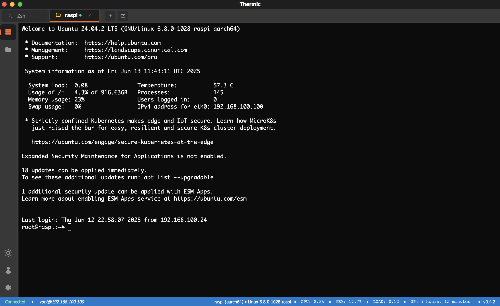
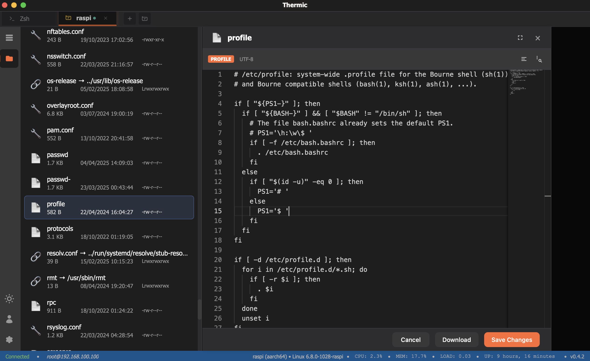

# Thermic

[](https://github.com/yzhelezko/thermic/actions)
[](https://github.com/yzhelezko/thermic/releases)
[](https://golang.org)
[](https://wails.io)
[](https://opensource.org/licenses/MIT)

A modern, cross-platform terminal emulator built with **Wails** and **xterm.js**, delivering a **VS Code-like terminal experience** with native performance and comprehensive **WSL support**.




## ✨ Features

### 🚀 **Core Features**
- **🖥️ Cross-Platform**: Native support for Windows, macOS, and Linux
- **🐧 WSL Integration**: Full Windows Subsystem for Linux support with automatic detection
- **⚡ VS Code Experience**: Same xterm.js library with identical terminal behavior
- **🎨 Modern UI**: Clean, dark-themed interface with responsive design
- **🔄 Real-Time**: Raw byte streaming for authentic terminal experience
- **🤖 AI-Powered Assistance**: Leverage integrated AI (OpenAI) for command explanations, troubleshooting, and more. ([See AI Integration](#ai-integration))

### 🛠️ **Shell Support**
- **Windows**: PowerShell, Command Prompt, PowerShell Core, WSL distributions
- **macOS**: zsh (default), bash, fish, and other common shells  
- **Linux**: bash, zsh, fish, sh, and all available shells
- **WSL**: Automatic detection and integration of all WSL distributions

## 🤖 AI Integration

Thermic brings the power of Artificial Intelligence directly into your terminal workflow. By integrating with AI providers like OpenAI, Thermic can help you:

- **Understand Commands**: Get quick explanations of complex shell commands.
- **Generate Examples**: Ask for examples of how to use specific tools or commands.
- **Troubleshoot Errors**: Paste error messages and get suggestions for fixes.
- **Summarize Text**: Quickly summarize logs or large blocks of text.
- **And more!**: Experiment with different prompts to streamline your tasks.

You can configure your AI provider (currently supporting OpenAI), add your API key, choose your preferred model, and easily enable or disable the AI features through the application settings.

## 🚀 Quick Start

### Option 1: Download Pre-built Binaries (Recommended)

1. **Download** the latest release for your platform:
   - [📥 **Download Latest Release**](https://github.com/yzhelezko/thermic/releases/latest)

### Option 2: Build from Source

1. **Prerequisites**:
   - Go 1.24+
   - Node.js 18+
   - Wails CLI v2

2. **Clone and build**:
   ```bash
   git clone https://github.com/yzhelezko/thermic.git
   cd thermic
   go mod tidy
   wails build
   ```

### 🔄 **Data Flow (VS Code Compatible)**
```
User Input → xterm.js → Wails Events → Go Backend → Shell Process
    ↑                                                      ↓
xterm.js ← Wails Events ← Go Backend ← Raw Byte Stream ← Shell Output
```

## 🔐 SSH Connection Support

Thermic provides **seamless SSH connectivity** with intelligent private key discovery:

### **🔑 Smart Key Discovery**
When you create an SSH profile **without specifying a private key path**, Thermic automatically:
- **🔍 Scans** your `.ssh` directory for all valid private keys
- **✅ Validates** each key file to ensure it's a proper SSH private key
- **🚀 Attempts** authentication with all discovered keys until one succeeds

### **📁 SSH Directory Locations**
Thermic looks for SSH keys in the standard locations:

- **🪟 Windows**: `C:\Users\[username]\.ssh\`
- **🐧 Linux**: `~/.ssh/` (typically `/home/[username]/.ssh/`)
- **🍎 macOS**: `~/.ssh/` (typically `/Users/[username]/.ssh/`)

### **🔧 SSH Key Support**
- **✅ RSA keys**: `id_rsa`, `my_server_key`, etc.
- **✅ Ed25519 keys**: `id_ed25519`, `github_key`, etc.
- **✅ ECDSA keys**: `id_ecdsa`, `server_ecdsa`, etc.
- **✅ DSA keys**: `id_dsa` (legacy support)
- **✅ Custom named keys**: Any valid private key file

**💡 Pro Tip**: Leave the `Private Key Path` field empty to enable automatic key discovery, or specify a exact path if you want to use a specific key.

## 🐧 WSL Integration

### **Seamless Experience**
- 🔄 **Easy Switching**: Toggle between Windows shells and Linux environments
- 🚀 **Auto-Start**: WSL distributions start automatically when selected  
- 🎨 **Native Display**: Full ANSI color and formatting support
- ⚙️ **VS Code Compatible**: Uses same WSL launching mechanism as VS Code

## 💻 Development

### **Development Mode**
```bash
wails dev
```
- Hot reload for frontend changes
- Automatic Go rebuilds
- Real-time debugging

### **Manual Building**
```bash
# Development build
wails build

# Production build with optimization
wails build -clean -trimpath
```

## 🎨 Terminal Features

### **Advanced Features** ✅
- **🎨 ANSI Colors**: Full color and formatting support
- **🔗 Clickable Links**: Web and file links detection
- **⌨️ Keyboard Shortcuts**: Standard terminal key bindings
- **📑 Multiple Tabs**: Support for multiple terminal sessions with drag-and-drop reordering
- **🔄 Tab Management**: Create, close, and switch between terminal tabs seamlessly
- **🖱️ Drag & Drop**: Reorder tabs by dragging them to new positions

## 🎯 Tab Management

### **Tab Features** ✅
- **➕ Create Tabs**: Multiple terminal sessions in a single window
- **🖱️ Drag & Drop**: Reorder tabs by dragging them to new positions  
- **🔄 Easy Switching**: Click tabs or use keyboard shortcuts to switch
- **❌ Close Tabs**: Close individual tabs while keeping others open
- **🏷️ Smart Titles**: Automatic tab naming based on shell type
- **🌐 SSH Support**: Create SSH connection tabs alongside local shells

## 🎯 Technology Stack

### **Backend**
- **Language**: Go 1.24+
- **Framework**: Wails v2
- **Terminal**: Custom PTY implementation with raw byte streaming
- **Shells**: Native process execution with stdin/stdout pipes
- **AI**: OpenAI API integration for AI-powered assistance.

### **Frontend**  
- **Terminal**: xterm.js (same as VS Code)
- **Addons**: fit-addon, web-links-addon
- **Build**: Vite bundling
- **Styling**: CSS with VS Code-inspired themes

### **Platform**
- **Windows**: WebView2 
- **macOS**: WKWebView
- **Linux**: WebKit2GTK

## 🤝 Contributing

We welcome contributions! Here's how to get started:

1. **🍴 Fork** the repository
2. **🌟 Create** a feature branch: `git checkout -b feature/amazing-feature`
3. **✅ Test** your changes: `go test ./...`
4. **📝 Commit** your changes: `git commit -m 'Add amazing feature'`
5. **🚀 Push** to the branch: `git push origin feature/amazing-feature`
6. **🔀 Create** a Pull Request

### **Development Guidelines**
- Follow Go formatting with `gofmt`
- Add tests for new features
- Update documentation as needed
- Test on multiple platforms when possible

## 📋 Roadmap

### **✅ Completed**
- [x] Real shell command execution with PTY
- [x] Raw byte streaming (VS Code compatibility)
- [x] ANSI color and formatting support
- [x] Interactive shell modes for all platforms
- [x] WSL (Windows Subsystem for Linux) integration
- [x] CI/CD pipeline with automated releases  
- [x] Cross-platform binary distribution
- [x] Professional UI with VS Code theming
- [x] Multiple terminal tabs with drag-and-drop reordering
- [x] Tab management (create, close, switch, rename)
- [x] SSH connection support with intelligent key discovery
- [x] AI integration with OpenAI (configurable provider, API key, model selection).

### **🚧 In Progress**  
- [ ] To be defined

### **🔮 Planned**
- [ ] To be defined

## 📄 License

This project is licensed under the **MIT License** - see the [LICENSE](LICENSE) file for details.

## 🙏 Acknowledgments

- **[Wails](https://wails.io)** - For the amazing Go-to-frontend framework
- **[xterm.js](https://xtermjs.org)** - For the robust terminal emulation library  
- **[VS Code](https://code.visualstudio.com)** - For terminal architecture inspiration
- **Go Community** - For the excellent ecosystem and tools

---

**⭐ Star this repository if you find it useful!**

Made with ❤️ using Go and Wails
